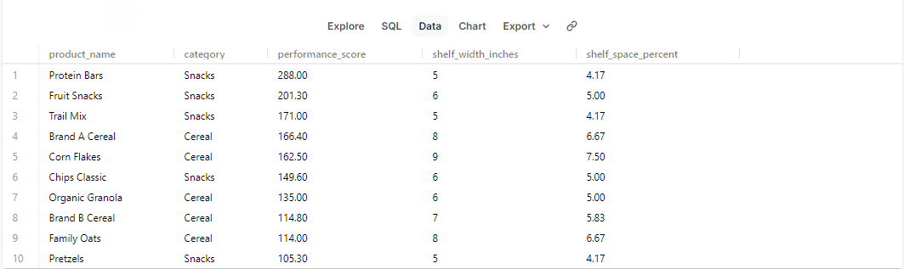

Retail Shelf Optimization Engine
SQL-Based Planogram Automation Simulation
Overview

This project simulates a simplified retail space planning automation system similar to enterprise merchandising optimization platforms.

The system:
Ranks products by performance
Enforces shelf space constraints
Maintains category-level business rules
Performs automated QA validation
Generates structured reporting output
Built using PostgreSQL and advanced SQL techniques.

Business Problem
Retail shelf space is limited and must be allocated strategically to maximize revenue and profitability while maintaining product category balance.
This project models that challenge using constraint-based optimization logic.

Data Model
products
Product name
Category
Weekly sales
Profit margin
Shelf width

shelf_constraints
Total shelf width available

Optimization Logic
Calculate performance score
weekly_sales × profit_margin
Prioritize minimum category requirements
Rank products by performance
Apply cumulative shelf constraint using window functions
Validate final selection

Example SQL Technique Used
SUM(shelf_width_inches) OVER (ORDER BY performance_score DESC)
This dynamically enforces cumulative shelf limits.

Skills Demonstrated
Advanced SQL (CTEs, Window Functions)
Business rule translation into code
Constraint-based optimization
QA validation processes
Data modeling
Reporting logic

Author

Thomas J. Meyer
Data Analyst | Cincinnati, OH
